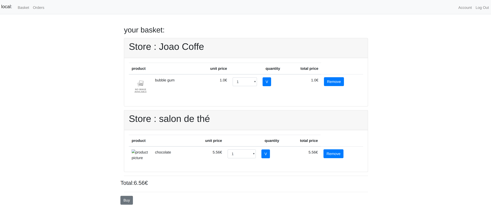
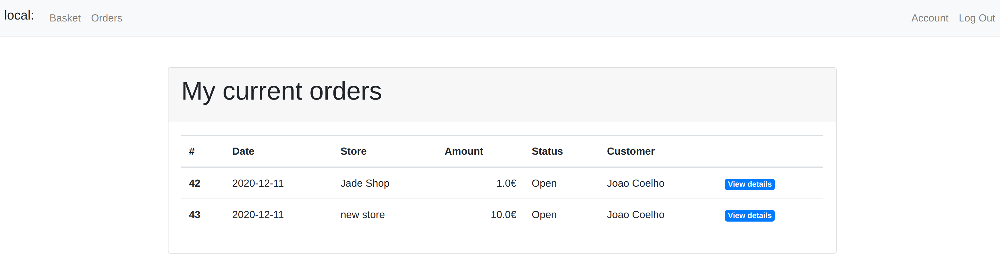
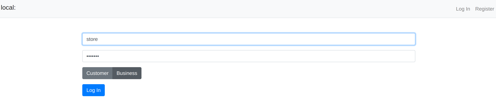

# local

**local** is a web platform that allows local businesses to sell their products online and make them available to a broader range of customers rather than just their locals ones and neighbors.

From restaurants to fruit shops, bakeries, or traditional product makers and sellers, they all have a chance to sell on **local**.
Local and traditional products are now accessible to everyone, everywhere.

## Motivation

This project is a consequence of CS50's final project to develop a software from scratch.
The idea was to build a web based application for small businesses, allowing them to have a platform to sell and showcase their products to a broader audience.

From a customer point of view they can find more products that are not accessible in big supermarkets and buy local in an easier way.

## Version

`1.0.0`

* As a **Business** you can:
    * register;
    * log in;
    * create a business (register your activity on **local**);
    * edit your account details;
    * add stores;
    * add products;
    * check orders received.

* As a **Customer** you can:
    * register;
    * log in;
    * edit your account details;
    * add products to a basket;
    * buy products.
   
## Screenshots

## Tech/framework used:

**local** was built with:

* Flask - as a web application framework;
* Bootstrap - for views' styling;
* Sqlite3 - for database management;

## Libraries

* Flask `pip install Flask`
* Flask-Session `pip install Flask-Session`
* CS50 `pip install cs50`
* WTForms `pip install WTForms`
* Flask-WTF `pip install Flask-WTF`

## How to launch local ?

1. Clone this repo
2. Check if you have all the packages installed on your machine
3. In your project directory, open your terminal and run:
    * Macbook or Linux `flask run`
    * Windows `python -m flask run`
4. On your terminal window will display "Running on http://(address):(port)"
5. Click or copy it to your browser
6. You are ready to go! 

## Improvements:

We hope `1.0.0` is the first version of a future real application and the improvements are constant but we already have this in mind:

* Filter stores by location or category
* Apply promo to product's price
* Send an email notification when orders' status change
* Apply a new design

## Credits

This project was an idea of two CS50 students who met online and that, after a couple of messages, decided to start working on this final project together.
They are:

* [@JadeRebecca](https://github.com/JadeRebecca)
* [@jopijuco](https://github.com/jopijuco)

## License

MIT License